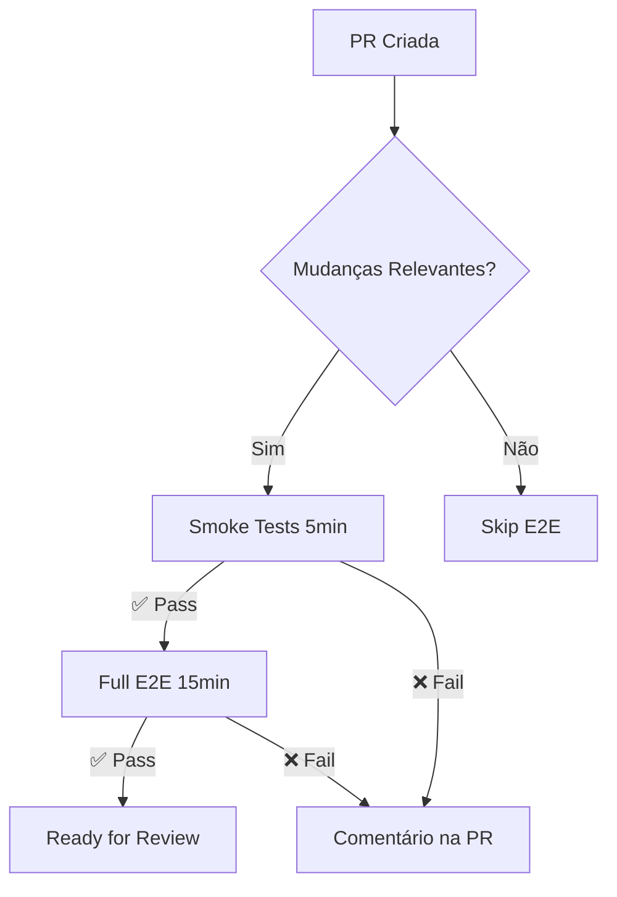
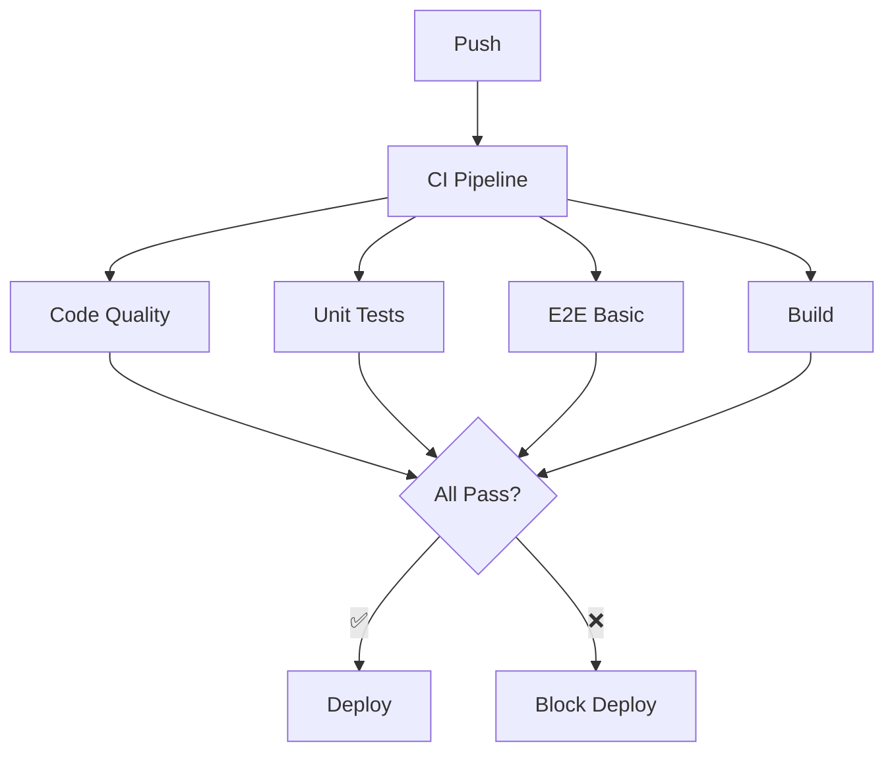
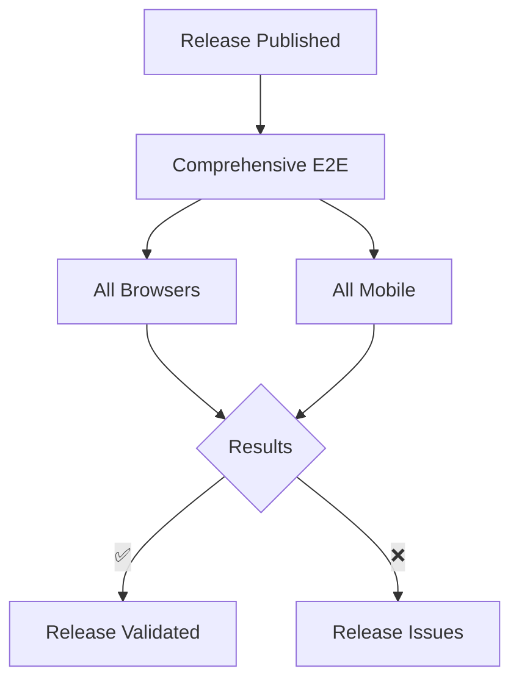

# 🚀 GitHub Actions Workflows

Este diretório contém todos os workflows do GitHub Actions para o projeto BFIN Frontend.

## 📋 Workflows Disponíveis

### `ci.yml` - Pipeline CI/CD Principal
**Trigger:** Push para main/develop, Pull Requests
**Duração:** ~15-20 minutos
```yaml
Jobs:
  - code-quality: ESLint, TypeScript, Design Tokens
  - tests: Testes unitários (Vitest)
  - e2e-tests: Testes E2E básicos (Chromium)
  - build: Build de validação
  - summary: Relatório consolidado
```

### `e2e.yml` - Testes E2E Completos
**Trigger:** Manual, Schedule diário (2AM), Releases
**Duração:** ~45-60 minutos
```yaml
Jobs:
  - e2e-comprehensive: Testes em todos os browsers
  - e2e-mobile: Testes em dispositivos mobile
  - summary: Relatório detalhado
```

**Configurações manuais:**
- Browser: chromium, firefox, webkit, all
- Padrão de testes: opcional
- Modo headed: true/false

### `e2e-pr.yml` - E2E Otimizado para PRs
**Trigger:** Pull Requests com mudanças relevantes
**Duração:** ~10-15 minutos
```yaml
Jobs:
  - analyze-changes: Detecta tipo de mudanças
  - e2e-smoke: Testes críticos rápidos
  - e2e-full: Testes completos (se não for draft)
  - pr-summary: Feedback detalhado na PR
```

### `deploy.yml` - Deploy Production
**Trigger:** Push para main (após CI passar)
**Duração:** ~5-10 minutos

### `update-sdk.yml` - Atualização SDK
**Trigger:** Schedule, Manual
**Duração:** ~2-3 minutos

## 🎯 Estratégia de Execução

### Pull Requests


### Main/Develop


### Releases


## ⚙️ Configurações Compartilhadas

### Secrets Necessários
```yaml
NPM_TOKEN: Token para acessar packages privados
VITE_API_BASE_URL: URL da API (opcional)
```

### Variáveis de Ambiente
```yaml
CI: true
FORCE_COLOR: 1
NODE_ENV: test
PLAYWRIGHT_BASE_URL: http://localhost:5173
```

### Artifacts Salvos
- **test-results/**: Resultados detalhados
- **playwright-report/**: Relatórios HTML
- **coverage/**: Cobertura de testes
- **dist/**: Build artifacts

## 🔧 Troubleshooting

### Workflow Stuck/Timeout
```bash
# Cancelar workflows em execução
gh run cancel <run-id>

# Listar runs ativos
gh run list --status in_progress
```

### Falha de Dependências
```yaml
# Limpar cache npm
- name: Clear npm cache
  run: npm cache clean --force
```

### Browsers não Instalados
```yaml
# Instalar com dependências do sistema
- name: Install Playwright
  run: npx playwright install --with-deps
```

### Timeout de Testes
```yaml
# Aumentar timeout
timeout-minutes: 60

# No playwright.config.ts
timeout: 60000
```

## 📊 Monitoramento

### Métricas Importantes
- **Success Rate**: Taxa de sucesso por workflow
- **Duration**: Tempo médio de execução
- **Flaky Tests**: Testes instáveis
- **Artifact Usage**: Downloads de relatórios

### Alertas Configurados
- Falha em smoke tests → Notificação imediata
- Falha recorrente → Após 3 falhas
- Performance degradada → Tempo > 45min

### Dashboards
- GitHub Insights: Actions → Workflows
- Relatórios Playwright: Artifacts → Reports

## 🚀 Otimizações Implementadas

### Performance
- ✅ Cache de browsers entre execuções
- ✅ Instalação seletiva por browser
- ✅ Matrix strategy para paralelização
- ✅ Execução condicional baseada em mudanças

### Reliability
- ✅ Retry automático em falhas temporárias
- ✅ Fail-fast desabilitado em matrix
- ✅ Timeouts adequados por job
- ✅ Cleanup automático de artifacts

### Developer Experience
- ✅ Comentários automáticos em PRs
- ✅ Relatórios visuais detalhados
- ✅ Feedback rápido com smoke tests
- ✅ Execução manual com opções

## 📈 Próximas Melhorias

### Planejado
- [ ] Testes de performance integrados
- [ ] Comparação visual automática
- [ ] Deploy de preview para E2E
- [ ] Integração com Slack/Teams
- [ ] Métricas de cobertura E2E

### Investigação
- [ ] Parallel sharding para testes longos
- [ ] Testes em diferentes versões do Node
- [ ] Testes cross-browser em PRs
- [ ] Auto-healing de testes flaky

## 🤝 Contribuindo

### Modificando Workflows
1. Edite os arquivos `.yml` neste diretório
2. Teste localmente com `act` (opcional)
3. Crie PR com as mudanças
4. Workflows são validados automaticamente

### Adicionando Novos Workflows
1. Crie novo arquivo `.yml`
2. Siga padrões existentes
3. Documente triggers e purpose
4. Adicione à tabela acima

### Debugging
```bash
# Executar workflow local (com act)
act -j e2e-tests

# Simular ambiente CI
npm run test:e2e:ci

# Ver logs detalhados
gh run view <run-id> --log
```